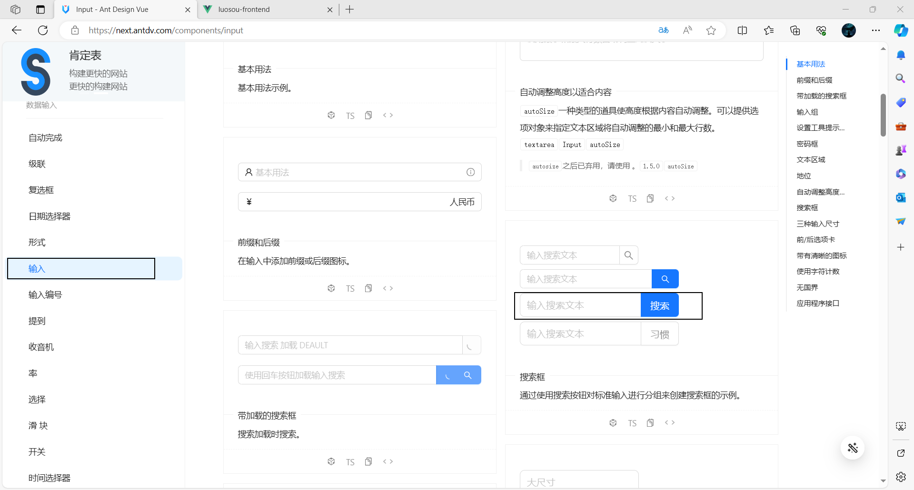

# 落樱搜索

## 项目介绍

用户可以在同一个入口（同一个页面）集中搜索出不同来源，不同类型的内容

**对于用户：**

- 提升用户的检索效率，提升用户的体验

**对于企业：**

- 无需针对每一个项目都去开发一个搜索功能，当你有新内容，新网站时，复用同一套搜索系统，提升开发效率

## 技术选型

**前端：**

- Vue
- Ant Design Vue
- Lodash

**后端：**

- Spring Boot
- MySQL
- ElasticSearch（Elastic Stack）搜索引擎
- 数据抓取
  - 离线
  - 实时
- 数据同步
  - 定时
  - 双写
  - logstash
  - Canal
- Guava Retrying
- Jmeter

## 业务流程

1. 先得到各种不同分类的数据
2. 提供一个搜索页面（单一搜索 + 聚合搜索），支持搜索
3. 单一搜索：根据关键词只搜索某个分类下的内容
4. 聚合搜索：根据关键词搜索不同分类下的内容


## 计划

**初始化**

- 前端
- 后端

**前端**

- 搜索页面
- URL记录页面搜索状态
- 整合Axios
- 文章列表页面
- 用户列表页面
- 搜索图片
- 聚合接口

**后端**

- 获取多种不同类型的数据源
  - 文章（内部）
  - 用户（内部）
  - 图片（外部，非该项目或者非该项目用户生产）
- 搜索图片
- 聚合接口
- 数据抓取
- 聚合搜索接口
  - 适配器模式
  - 门面模式
- ElasticSearch的搭建及入门
- ElasticSearch的使用（建表，读写数据，调API，整合）
- 数据同步

**优化**

- 保障接口稳定性

- 搜索结果关键词高亮
- 搜索建议提示
- 防抖节流

## 初始化

### 前端

[快速上手 - Ant Design Vue (antdv.com)](https://antdv.com/docs/vue/getting-started-cn)

1. 安装脚手架工具[vue-cli](https://github.com/vuejs/vue-cli)

```sh
#权限不够，就以管理员身份打开CMD
npm install -g @vue/cli
```


2. 创建一个项目

```sh
vue create luosou-frontend
```


3. 引入组件库

```sh
npm i --save ant-design-vue@4.x
```


4. 启动


### 后端

1. 使用模板 

   把模板的目录名改成项目名

2. 连接本地数据库

3. 创建数据库


4. 开启redis


5. 修改端口


6. 修改项目名


7. 启动并访问接口文档


## 前端

### 搜索页面

1. 修整文件


2. 选择组件




3. 引入组件


4. 美化页面


5. 展示


### URL记录页面搜索状态

用URL记录页面搜索状态，当用户刷新页面时，能够从URL还原之前的页面搜索状态

**核心：**

状态同步改为单向，即只允许URL来改变页面状态，不允许反向

1. 用户与页面交互时，改变URL地址（例如：点击搜索，需要把搜索内容填充的URL；切换Tab时，URL也要填充tab）
2. 当URL地址改变时，改变页面状态（监听URL的变化）

**实现：**

1. 添加动态路由


2. 用户与页面交互时，改变URL地址


3. 当URL地址改变时，改变页面状态


### 整合Axios

[起步 | Axios中文文档 | Axios中文网 (axios-http.cn)](https://www.axios-http.cn/docs/intro)

1. 安装

```sh
npm install axios
```


2. 创建实例

```ts
import axios from "axios";

const myAxios = axios.create({
  baseURL: "http://localhost:8083/api",
  timeout: 10000,
});
myAxios.defaults.withCredentials = true;

// 添加请求拦截器
myAxios.interceptors.request.use(
  function (config) {
    // 在发送请求之前做些什么
    return config;
  },
  function (error) {
    // 对请求错误做些什么
    return Promise.reject(error);
  }
);

// 添加响应拦截器
myAxios.interceptors.response.use(
  function (response) {
    // 2xx 范围内的状态码都会触发该函数。
    // 对响应数据做点什么
    const data = response.data;
    if (data.code === 0) {
      return data.data;
    } else {
      throw new Error(data.message);
    }
  },
  function (error) {
    // 超出 2xx 范围的状态码都会触发该函数。
    // 对响应错误做点什么
    return Promise.reject(error);
  }
);

export default myAxios;
```

### 文章列表页面

1. 选择组件


2. 引入组件


3. 展示


### 用户列表页面

1. 选择组件


2. 引入组件

   先把文章列表页面复制过来，post全局替换成user


### 搜索图片

1. 修改图片列表页


2. 请求数据


​    目前是在页面加载时，同时调用三个接口分别获取文章，图片用户数据

**几种不同业务场景：**

1）用户点击某个tab时，只调用这个tab的接口。

2）**如果是针对聚合内容的网页，可以一个请求搞定**

3）可能还要查询其他类型下的数据，比如其他类型数据的总数，反馈给用户

**存在问题：**

1. 单次请求数量比较多，可能受到浏览器限制 
2. 前端请求不同数据接口的参数可能不一致，增减前后端沟通成本 
3. 重复代码比较多


### 聚合接口

1. 单次请求数量比较多，可能受到浏览器限制 => 用一个接口请求完所有数据√
2. 前端请求不同数据接口的参数可能不一致，增减前后端沟通成本 => 用一个接口把请求参数统一，前端每次传固定的参数，后端去对参数进行转换
3. 前端重复代码比较多 => 用一个接口，通过不同的参数去区分要搜索的数据的类型


## 后端

### 获取多种不同类型的数据源

**数据抓取的方式：**

1. 直接请求数据接口

2. 网页渲染出明文内容后，从html页面中抓取

3. 有些网站是动态请求的，不会一次性加载所有数据，需要进行一些验证（输入验证码，滑块，识别图像或文字，点击按钮...），才能显示数据。无头浏览器：使用程序打开一个浏览器，并控制程序去代替人工进行一些验证

   [Selenium](https://www.selenium.dev/zh-cn/)

   [Puppeteer 中文网 (nodejs.cn)](https://pptr.nodejs.cn/)

**直接请求数据接口：**

HttpClient，OKHttp，Hutool，RestTemplate

1. 获取数据
2. 处理数据
3. 写入数据库

#### 文章（内部）

内部没有，使用爬虫从互联网上获取基础数据[文章 - 编程导航 (code-nav.cn)](https://www.code-nav.cn/learn/passage)

**离线抓取：**定时或手动抓取数据存到自己的数据库


```java
/**
 * 获取初始帖子列表
 */
//每次启动项目，会把该类注册成为bean，执行一次run方法
//注释掉@Component注解，每次启动项目就不会执行一次run方法
@Component
@Slf4j
public class FetchInitPostList implements CommandLineRunner {

    @Resource
    private PostService postService;

    @Resource
    private PostEsDao postEsDao;

    @Override
    public void run(String... args) {
        // 1. 获取数据
        String json = "{\n" +
                "  \"current\": 2,\n" +
                "  \"pageSize\": 8,\n" +
                "  \"sortField\": \"createTime\",\n" +
                "  \"sortOrder\": \"descend\",\n" +
                "  \"category\": \"文章\",\n" +
                "  \"reviewStatus\": 1\n" +
                "}";
        String url = "https://www.code-nav.cn/api/post/search/page/vo";
        String result2 = HttpRequest
                .post(url)
                .body(json)
                .execute().body();
        System.out.println(result2);
        // 2. json转对象
        Map<String, Object> map = JSONUtil.toBean(result2, Map.class);
        JSONObject data = (JSONObject) map.get("data");
        JSONArray records = (JSONArray) data.get("records");
        List<Post> postList = new ArrayList<>();
        for (Object record : records) {
            JSONObject tempRecord = (JSONObject) record;
            Post post = new Post();
            post.setTitle(tempRecord.getStr("title"));
            post.setContent(tempRecord.getStr("content"));
            JSONArray tags = (JSONArray) tempRecord.get("tags");
            List<String> tagList = tags.toList(String.class);
            System.out.println(tagList);
            post.setTags(JSONUtil.toJsonStr(tagList));
            post.setUserId(1l);
            postList.add(post);
        }
        //写入数据库
        boolean result = postService.saveBatch(postList);
        if (result) {
            log.info("获取初始帖子列表成功，条数={}", postList.size());
        } else {
            log.error("获取初始帖子列表失败");
        }
    }
}
```

#### 用户（内部）

自己造假数据

#### 图片

**实时抓取：**自己网站的数据库不存数据，而是用户搜索的时候，转发请求从别人的接口/网站获取数据

**使用 Jsoup：**

获取到HTML文档，然后从中解析出需要的字段

1. 引入依赖

```xml
<!-- https://mvnrepository.com/artifact/org.jsoup/jsoup -->
<dependency>
    <groupId>org.jsoup</groupId>
    <artifactId>jsoup</artifactId>
    <version>1.15.3</version>
</dependency>
```

2. 复制官网的例子进行修改https://jsoup.org/

```java
/**
 * 图片
 */
@Data
public class Picture {
    private String title;

    private String url;
}
```

```java
@Test
void testFetchPicture() throws IOException {
    int current = 1;
    String url = String.format("https://cn.bing.com/images/search?q=小黑子&first=%s", current);
    Document doc = Jsoup.connect(url).get();
    //System.out.println(doc);
    Elements elements = doc.select(".iuscp.isv");
    List<Picture> pictureList = new ArrayList<>();
    for (Element element : elements) {
        //图片地址:murl
        String m = element.select(".iusc").get(0).attr("m");
        Map<String, Object> map = JSONUtil.toBean(m, Map.class);
        String murl = (String) map.get("murl");
        // System.out.println("murl = " + murl);
        //图片标题
        String title = element.select(".inflnk").get(0).attr("aria-label");
        // System.out.println("title = " + title);
        Picture picture = new Picture();
        picture.setTitle(title);
        picture.setUrl(murl);
        pictureList.add(picture);
    }
}
```

### 搜索图片

```java
/**
 * 查询请求
 *
 */
@EqualsAndHashCode(callSuper = true)
@Data
public class PictureQueryRequest extends PageRequest implements Serializable {
    /**
     * 搜索词
     */
    private String searchText;

    private static final long serialVersionUID = 1L;
}
```

```java
/**
 * 图片服务
 */
public interface PictureService {
    /**
     * 搜搜图片
     * @param current
     * @param pageSize
     * @param searchText
     * @return
     */
    Page<Picture> searchPicture(long current, long pageSize, String searchText);
}
```

```java
/**
 * 图片获取服务实现
 */
@Service
@Slf4j
public class PictureServiceImpl implements PictureService {


    @Override
    public Page<Picture> searchPicture(long current, long pageSize, String searchText) {
        Page<Picture> page =new Page<>(current,pageSize);
        current = (current - 1) * pageSize;
        String url = String.format("https://cn.bing.com/images/search?q=%s&first=%s", searchText, current);
        Document doc = null;
        try {
            doc = Jsoup.connect(url).get();
        } catch (IOException e) {
            throw new BusinessException(ErrorCode.SYSTEM_ERROR, "数据获取异常");
        }
        Elements elements = doc.select(".iuscp.isv");
        List<Picture> pictureList = new ArrayList<>();
        for (Element element : elements) {
            if (pictureList.size() >= pageSize){
                break;
            }
            //图片地址:murl
            String m = element.select(".iusc").get(0).attr("m");
            Map<String, Object> map = JSONUtil.toBean(m, Map.class);
            String murl = (String) map.get("murl");
            //图片标题
            String title = element.select(".inflnk").get(0).attr("aria-label");

            Picture picture = new Picture();
            picture.setTitle(title);
            picture.setUrl(murl);
            pictureList.add(picture);
        }
        page.setRecords(pictureList);
        return page;
    }
}
```

```java
/**
 * 图片接口
 */
@RestController
@RequestMapping("/picture")
@Slf4j
public class PictureController {
    @Resource
    private PictureService pictureService;

    /**
     * 分页获取图片
     *
     * @param pictureQueryRequest
     * @param request
     * @return
     */
    @PostMapping("/list/page/vo")
    public BaseResponse<Page<Picture>> listPictureVOByPage(@RequestBody PictureQueryRequest pictureQueryRequest,
                                                           HttpServletRequest request) {
        long current = pictureQueryRequest.getCurrent();
        long pageSize = pictureQueryRequest.getPageSize();
        // 限制爬虫
        ThrowUtils.throwIf(pageSize > 20, ErrorCode.PARAMS_ERROR);
        Page<Picture> pictureList = pictureService.searchPicture(current, pageSize, pictureQueryRequest.getSearchText());
        return ResultUtils.success(pictureList);
    }
}
```

### 聚合接口

```java
/**
 * 查询请求
 *
 */
@EqualsAndHashCode(callSuper = true)
@Data
public class SearchRequest extends PageRequest implements Serializable {
    /**
     * 搜索词
     */
    private String searchText;

    private static final long serialVersionUID = 1L;
}
```

```java
/**
 * 聚合搜索
 */
@Data
public class SearchVO {
    private List<UserVO> userList;
    private List<PostVO> postList;
    private List<Picture> pictureList;
}
```

并发查询不一定快，存在短板效应

```java
/**
 * 聚合接口
 */
@RestController
@RequestMapping("/search")
@Slf4j
public class SearchController {
    @Resource
    private PictureService pictureService;

    @Resource
    private UserService userService;

    @Resource
    private PostService postService;

    /**
     * 聚合
     *
     * @param searchRequest
     * @return
     */
    @PostMapping("/all")
    public BaseResponse<SearchVO> searchAll(@RequestBody SearchRequest searchRequest, HttpServletRequest request) {
        String searchText = searchRequest.getSearchText();
        CompletableFuture<Page<Picture>> pictureTask = CompletableFuture.supplyAsync(() -> pictureService.searchPicture(1, 10, searchText));
        CompletableFuture<Page<UserVO>> userTask = CompletableFuture.supplyAsync(() -> {
            UserQueryRequest userQueryRequest = new UserQueryRequest();
            userQueryRequest.setCurrent(1);
            userQueryRequest.setPageSize(10);
            userQueryRequest.setUserName(searchText);
            return userService.listUserVOByPage(userQueryRequest);
        });

        CompletableFuture<Page<PostVO>> postTask = CompletableFuture.supplyAsync(() -> {
            PostQueryRequest postQueryRequest = new PostQueryRequest();
            postQueryRequest.setSearchText(searchText);
            postQueryRequest.setTitle(searchText);
            postQueryRequest.setCurrent(1);
            postQueryRequest.setPageSize(10);

            return postService.listPostVOByPage(postQueryRequest, request);
        });

        CompletableFuture.allOf(pictureTask, userTask, postTask).join();


        SearchVO searchVO = new SearchVO();
        try {
            searchVO.setPictureList(pictureTask.get().getRecords());
            searchVO.setUserList(userTask.get().getRecords());
            searchVO.setPostList(postTask.get().getRecords());
        } catch (Exception e) {
            log.error("查询异常", e);
            throw new BusinessException(ErrorCode.SYSTEM_ERROR);
        }

        return ResultUtils.success(searchVO);
    }
}
```