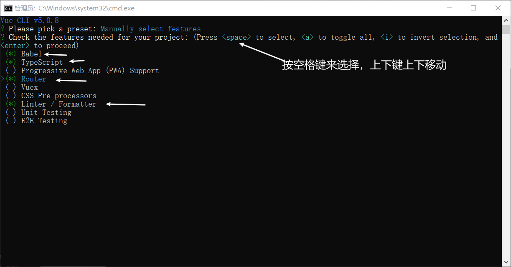
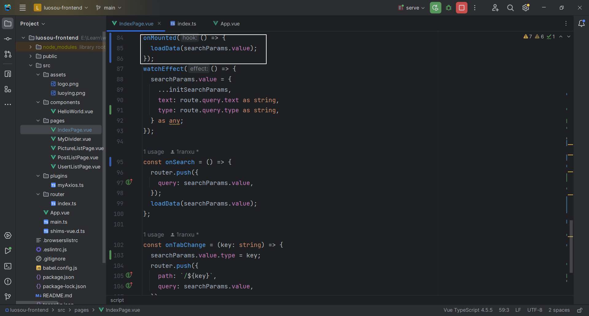
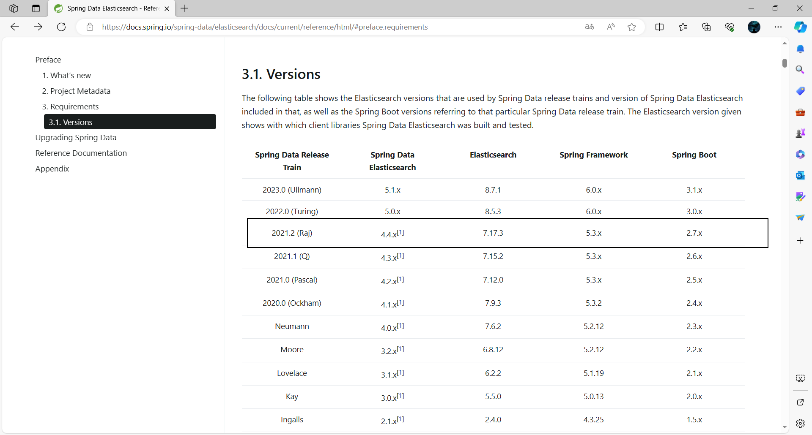
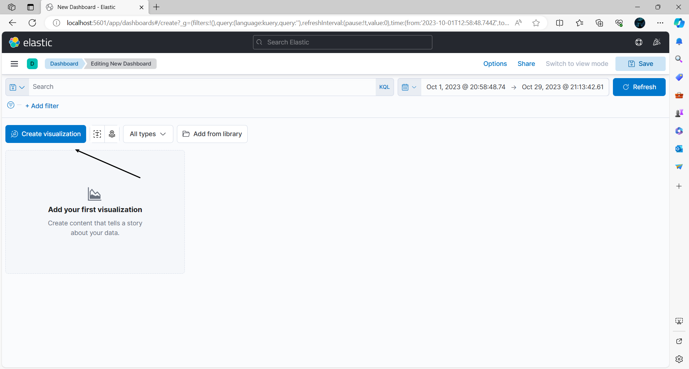
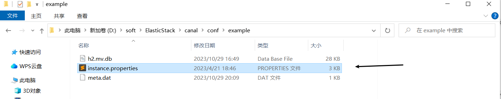

# 落樱搜索

## 项目介绍

用户可以在同一个入口（同一个页面）集中搜索出不同来源，不同类型的内容

**对于用户：**

- 提升用户的检索效率，提升用户的体验

**对于企业：**

- 无需针对每一个项目都去开发一个搜索功能，当你有新内容，新网站时，复用同一套搜索系统，提升开发效率

## 技术选型

**前端：**

- Vue
- Ant Design Vue
- Lodash

**后端：**

- Spring Boot
- MySQL
- ElasticSearch（Elastic Stack）搜索引擎
- 数据抓取
  - 离线
  - 实时
- 数据同步
  - 定时
  - 双写
  - logstash
  - Canal
- Guava Retrying
- Jmeter

## 业务流程

1. 先得到各种不同分类的数据
2. 提供一个搜索页面（单一搜索 + 聚合搜索），支持搜索
3. 单一搜索：根据关键词只搜索某个分类下的内容
4. 聚合搜索：根据关键词搜索不同分类下的内容


## 计划

**初始化**

- 前端
- 后端

**前端**

- 搜索页面
- URL记录页面搜索状态
- 整合Axios
- 文章列表页面
- 用户列表页面
- 搜索图片
- 聚合接口
- 聚合接口优化

**后端**

- 获取多种不同类型的数据源
  - 文章（内部）
  - 用户（内部）
  - 图片（外部，非该项目或者非该项目用户生产）
- 搜索图片
- 聚合接口
- 聚合接口优化
  - 门面模式
  - 适配器模式
  - 注册器模式
- ElasticSearch
- 数据同步
- 搜索建议
- 关键词高亮
- 前端防抖节流

**优化**

- 保障接口稳定性
- 

## 初始化

### 前端

[快速上手 - Ant Design Vue (antdv.com)](https://antdv.com/docs/vue/getting-started-cn)

1. 安装脚手架工具[vue-cli](https://github.com/vuejs/vue-cli)

```sh
#权限不够，就以管理员身份打开CMD
npm install -g @vue/cli
```


2. 创建一个项目

```sh
vue create luosou-frontend
```





3. 引入组件库

```sh
npm i --save ant-design-vue@4.x
```


4. 启动


### 后端

1. 使用模板 

   把模板的目录名改成项目名

2. 连接本地数据库

3. 创建数据库


4. 开启redis


5. 修改端口


6. 修改项目名


7. 启动并访问接口文档


## 前端

### 搜索页面

1. 修整文件


2. 选择组件


3. 引入组件


4. 美化页面


### URL记录页面搜索状态

用URL记录页面搜索状态，当用户刷新页面时，能够从URL还原之前的页面搜索状态

**核心：**

状态同步改为单向，即只允许URL来改变页面状态，不允许反向

1. 用户与页面交互时，改变URL地址（例如：点击搜索，需要把搜索内容填充的URL；切换Tab时，URL也要填充tab）
2. 当URL地址改变时，改变页面状态（监听URL的变化）

**实现：**

1. 添加动态路由


2. 用户与页面交互时，改变URL地址


3. 当URL地址改变时，改变页面状态


### 整合Axios

[起步 | Axios中文文档 | Axios中文网 (axios-http.cn)](https://www.axios-http.cn/docs/intro)

1. 安装

```sh
npm install axios
```


2. 创建实例

```ts
import axios from "axios";

const myAxios = axios.create({
  baseURL: "http://localhost:8083/api",
  timeout: 10000,
});
myAxios.defaults.withCredentials = true;

// 添加请求拦截器
myAxios.interceptors.request.use(
  function (config) {
    // 在发送请求之前做些什么
    return config;
  },
  function (error) {
    // 对请求错误做些什么
    return Promise.reject(error);
  }
);

// 添加响应拦截器
myAxios.interceptors.response.use(
  function (response) {
    // 2xx 范围内的状态码都会触发该函数。
    // 对响应数据做点什么
    const data = response.data;
    if (data.code === 0) {
      return data.data;
    } else {
      throw new Error(data.message);
    }
  },
  function (error) {
    // 超出 2xx 范围的状态码都会触发该函数。
    // 对响应错误做点什么
    return Promise.reject(error);
  }
);

export default myAxios;
```

### 文章列表页面

1. 选择组件


2. 引入组件


3. 展示


### 用户列表页面

1. 选择组件


2. 引入组件

   先把文章列表页面复制过来，post全局替换成user


### 搜索图片

1. 修改图片列表页


2. 请求数据


​    目前是在页面加载时，同时调用三个接口分别获取文章，图片用户数据

**几种不同业务场景：**

1）用户点击某个tab时，只调用这个tab的接口。

2）**如果是针对聚合内容的网页，可以一个请求搞定**

3）可能还要查询其他类型下的数据，比如其他类型数据的总数，反馈给用户

**存在问题：**

1. 单次请求数量比较多，可能受到浏览器限制 
2. 前端请求不同数据接口的参数可能不一致，增减前后端沟通成本 
3. 重复代码比较多


### 聚合接口

1. 单次请求数量比较多，可能受到浏览器限制 => 用一个接口请求完所有数据√
2. 前端请求不同数据接口的参数可能不一致，增减前后端沟通成本 => 用一个接口把请求参数统一，前端每次传固定的参数，后端去对参数进行转换
3. 前端重复代码比较多 => 用一个接口，通过不同的参数去区分要搜索的数据的类型


### 聚合接口优化





## 后端

### 获取多种不同类型的数据源

**数据抓取的方式：**

1. 直接请求数据接口

2. 网页渲染出明文内容后，从html页面中抓取

3. 有些网站是动态请求的，不会一次性加载所有数据，需要进行一些验证（输入验证码，滑块，识别图像或文字，点击按钮...），才能显示数据。无头浏览器：使用程序打开一个浏览器，并控制程序去代替人工进行一些验证

   [Selenium](https://www.selenium.dev/zh-cn/)

   [Puppeteer 中文网 (nodejs.cn)](https://pptr.nodejs.cn/)

**直接请求数据接口：**

HttpClient，OKHttp，Hutool，RestTemplate

1. 获取数据
2. 处理数据
3. 写入数据库

#### 文章（内部）

内部没有，使用爬虫从互联网上获取基础数据[文章 - 编程导航 (code-nav.cn)](https://www.code-nav.cn/learn/passage)

**离线抓取：**定时或手动抓取数据存到自己的数据库


```java
/**
 * 获取初始帖子列表
 */
//每次启动项目，会把该类注册成为bean，执行一次run方法
//注释掉@Component注解，每次启动项目就不会执行一次run方法
@Component
@Slf4j
public class FetchInitPostList implements CommandLineRunner {

    @Resource
    private PostService postService;

    @Resource
    private PostEsDao postEsDao;

    @Override
    public void run(String... args) {
        // 1. 获取数据
        String json = "{\n" +
                "  \"current\": 2,\n" +
                "  \"pageSize\": 8,\n" +
                "  \"sortField\": \"createTime\",\n" +
                "  \"sortOrder\": \"descend\",\n" +
                "  \"category\": \"文章\",\n" +
                "  \"reviewStatus\": 1\n" +
                "}";
        String url = "https://www.code-nav.cn/api/post/search/page/vo";
        String result2 = HttpRequest
                .post(url)
                .body(json)
                .execute().body();
        System.out.println(result2);
        // 2. json转对象
        Map<String, Object> map = JSONUtil.toBean(result2, Map.class);
        JSONObject data = (JSONObject) map.get("data");
        JSONArray records = (JSONArray) data.get("records");
        List<Post> postList = new ArrayList<>();
        for (Object record : records) {
            JSONObject tempRecord = (JSONObject) record;
            Post post = new Post();
            post.setTitle(tempRecord.getStr("title"));
            post.setContent(tempRecord.getStr("content"));
            JSONArray tags = (JSONArray) tempRecord.get("tags");
            List<String> tagList = tags.toList(String.class);
            System.out.println(tagList);
            post.setTags(JSONUtil.toJsonStr(tagList));
            post.setUserId(1l);
            postList.add(post);
        }
        //写入数据库
        boolean result = postService.saveBatch(postList);
        if (result) {
            log.info("获取初始帖子列表成功，条数={}", postList.size());
        } else {
            log.error("获取初始帖子列表失败");
        }
    }
}
```

#### 用户（内部）

自己造假数据

#### 图片

**实时抓取：**自己网站的数据库不存数据，而是用户搜索的时候，转发请求从别人的接口/网站获取数据

**使用 Jsoup：**

获取到HTML文档，然后从中解析出需要的字段

1. 引入依赖

```xml
<!-- https://mvnrepository.com/artifact/org.jsoup/jsoup -->
<dependency>
    <groupId>org.jsoup</groupId>
    <artifactId>jsoup</artifactId>
    <version>1.15.3</version>
</dependency>
```

2. 复制官网的例子进行修改https://jsoup.org/

```java
/**
 * 图片
 */
@Data
public class Picture {
    private String title;

    private String url;
}
```

```java
@Test
void testFetchPicture() throws IOException {
    int current = 1;
    String url = String.format("https://cn.bing.com/images/search?q=小黑子&first=%s", current);
    Document doc = Jsoup.connect(url).get();
    //System.out.println(doc);
    Elements elements = doc.select(".iuscp.isv");
    List<Picture> pictureList = new ArrayList<>();
    for (Element element : elements) {
        //图片地址:murl
        String m = element.select(".iusc").get(0).attr("m");
        Map<String, Object> map = JSONUtil.toBean(m, Map.class);
        String murl = (String) map.get("murl");
        // System.out.println("murl = " + murl);
        //图片标题
        String title = element.select(".inflnk").get(0).attr("aria-label");
        // System.out.println("title = " + title);
        Picture picture = new Picture();
        picture.setTitle(title);
        picture.setUrl(murl);
        pictureList.add(picture);
    }
}
```

### 搜索图片

```java
/**
 * 查询请求
 *
 */
@EqualsAndHashCode(callSuper = true)
@Data
public class PictureQueryRequest extends PageRequest implements Serializable {
    /**
     * 搜索词
     */
    private String searchText;

    private static final long serialVersionUID = 1L;
}
```

```java
/**
 * 图片服务
 */
public interface PictureService {
    /**
     * 搜搜图片
     * @param current
     * @param pageSize
     * @param searchText
     * @return
     */
    Page<Picture> searchPicture(long current, long pageSize, String searchText);
}
```

```java
/**
 * 图片获取服务实现
 */
@Service
@Slf4j
public class PictureServiceImpl implements PictureService {


    @Override
    public Page<Picture> searchPicture(long current, long pageSize, String searchText) {
        Page<Picture> page =new Page<>(current,pageSize);
        current = (current - 1) * pageSize;
        String url = String.format("https://cn.bing.com/images/search?q=%s&first=%s", searchText, current);
        Document doc = null;
        try {
            doc = Jsoup.connect(url).get();
        } catch (IOException e) {
            throw new BusinessException(ErrorCode.SYSTEM_ERROR, "数据获取异常");
        }
        Elements elements = doc.select(".iuscp.isv");
        List<Picture> pictureList = new ArrayList<>();
        for (Element element : elements) {
            if (pictureList.size() >= pageSize){
                break;
            }
            //图片地址:murl
            String m = element.select(".iusc").get(0).attr("m");
            Map<String, Object> map = JSONUtil.toBean(m, Map.class);
            String murl = (String) map.get("murl");
            //图片标题
            String title = element.select(".inflnk").get(0).attr("aria-label");

            Picture picture = new Picture();
            picture.setTitle(title);
            picture.setUrl(murl);
            pictureList.add(picture);
        }
        page.setRecords(pictureList);
        return page;
    }
}
```

```java
/**
 * 图片接口
 */
@RestController
@RequestMapping("/picture")
@Slf4j
public class PictureController {
    @Resource
    private PictureService pictureService;

    /**
     * 分页获取图片
     *
     * @param pictureQueryRequest
     * @param request
     * @return
     */
    @PostMapping("/list/page/vo")
    public BaseResponse<Page<Picture>> listPictureVOByPage(@RequestBody PictureQueryRequest pictureQueryRequest,
                                                           HttpServletRequest request) {
        long current = pictureQueryRequest.getCurrent();
        long pageSize = pictureQueryRequest.getPageSize();
        // 限制爬虫
        ThrowUtils.throwIf(pageSize > 20, ErrorCode.PARAMS_ERROR);
        Page<Picture> pictureList = pictureService.searchPicture(current, pageSize, pictureQueryRequest.getSearchText());
        return ResultUtils.success(pictureList);
    }
}
```

### 聚合接口

```java
/**
 * 查询请求
 *
 */
@EqualsAndHashCode(callSuper = true)
@Data
public class SearchRequest extends PageRequest implements Serializable {
    /**
     * 搜索词
     */
    private String searchText;

    private static final long serialVersionUID = 1L;
}
```

```java
/**
 * 聚合搜索
 */
@Data
public class SearchVO {
    private List<UserVO> userList;
    private List<PostVO> postList;
    private List<Picture> pictureList;
}
```

并发查询不一定快，存在短板效应

```java
/**
 * 聚合接口
 */
@RestController
@RequestMapping("/search")
@Slf4j
public class SearchController {
    @Resource
    private PictureService pictureService;

    @Resource
    private UserService userService;

    @Resource
    private PostService postService;

    /**
     * 聚合
     *
     * @param searchRequest
     * @return
     */
    @PostMapping("/all")
    public BaseResponse<SearchVO> searchAll(@RequestBody SearchRequest searchRequest, HttpServletRequest request) {
        String searchText = searchRequest.getSearchText();
        CompletableFuture<Page<Picture>> pictureTask = CompletableFuture.supplyAsync(() -> pictureService.searchPicture(1, 10, searchText));
        CompletableFuture<Page<UserVO>> userTask = CompletableFuture.supplyAsync(() -> {
            UserQueryRequest userQueryRequest = new UserQueryRequest();
            userQueryRequest.setCurrent(1);
            userQueryRequest.setPageSize(10);
            userQueryRequest.setUserName(searchText);
            return userService.listUserVOByPage(userQueryRequest);
        });

        CompletableFuture<Page<PostVO>> postTask = CompletableFuture.supplyAsync(() -> {
            PostQueryRequest postQueryRequest = new PostQueryRequest();
            postQueryRequest.setSearchText(searchText);
            postQueryRequest.setTitle(searchText);
            postQueryRequest.setCurrent(1);
            postQueryRequest.setPageSize(10);

            return postService.listPostVOByPage(postQueryRequest, request);
        });

        CompletableFuture.allOf(pictureTask, userTask, postTask).join();


        SearchVO searchVO = new SearchVO();
        try {
            searchVO.setPictureList(pictureTask.get().getRecords());
            searchVO.setUserList(userTask.get().getRecords());
            searchVO.setPostList(postTask.get().getRecords());
        } catch (Exception e) {
            log.error("查询异常", e);
            throw new BusinessException(ErrorCode.SYSTEM_ERROR);
        }

        return ResultUtils.success(searchVO);
    }
}
```

### 聚合接口优化

让前端既能一次搜出所有数据，又能够获取某一类数据（比如分页）

前端传type，调用后端同一个接口，后端根据type调用不同的service查询

比如：type = user ，userService.query()

1. 如果type为空，那么搜索所有的数据
2. 如果不为空
   1. 如果type合法，查出对应数据
   2. 否则报错

问题：

1. type增多后，查询逻辑堆积在controller代码里

#### **门面模式**

让用户（客户端）更轻松地去使用服务，不需要关心门面背后的细节

```java
/**
 * 聚合接口
 */
@RestController
@RequestMapping("/search")
@Slf4j
public class SearchController {
    @Resource
    private SearchFacade searchFacade;
    /**
     * 聚合
     *
     * @param searchRequest
     * @return
     */
    @PostMapping("/all")
    public BaseResponse<SearchVO> searchAll(@RequestBody SearchRequest searchRequest, HttpServletRequest request) {
        SearchVO searchVO = searchFacade.searchAll(searchRequest, request);
        return ResultUtils.success(searchVO);
    }
}
```

```java
@Component
@Slf4j
public class SearchFacade {
    @Resource
    private PostDataSource postDataSource;

    @Resource
    private UserDataSource userDataSource;

    @Resource
    private PictureDataSource pictureDataSource;

    @Resource
    private DataSourceRegistry dataSourceRegistry;

    public SearchVO searchAll(SearchRequest searchRequest, HttpServletRequest request) {
        String type = searchRequest.getType();
        SearchTypeEnum searchTypeEnum = SearchTypeEnum.getEnumByValue(type);
        String searchText = searchRequest.getSearchText();
        long current = searchRequest.getCurrent();
        long pageSize = searchRequest.getPageSize();

        SearchVO searchVO = new SearchVO();
        if (searchTypeEnum == null) {
            CompletableFuture<Page<Picture>> pictureTask =
                    CompletableFuture.supplyAsync(() -> pictureDataSource.doSearch(searchText, current, pageSize));
            CompletableFuture<Page<UserVO>> userTask = CompletableFuture.supplyAsync(() -> {
                return userDataSource.doSearch(searchText, current, pageSize);
            });

            CompletableFuture<Page<PostVO>> postTask = CompletableFuture.supplyAsync(() -> {
                return postDataSource.doSearch(searchText, current, pageSize);
            });

            CompletableFuture.allOf(pictureTask, userTask, postTask).join();

            try {
                searchVO.setPictureList(pictureTask.get().getRecords());
                searchVO.setUserList(userTask.get().getRecords());
                searchVO.setPostList(postTask.get().getRecords());
            } catch (Exception e) {
                log.error("查询异常", e);
                throw new BusinessException(ErrorCode.SYSTEM_ERROR);
            }

        } else {
            DataSource dataSource = dataSourceRegistry.getDataSourceByType(type);
            Page page = dataSource.doSearch(searchText, current, pageSize);
            searchVO.setDataList(page.getRecords());
        }
        return searchVO;
    }
}
```

#### **适配器模式**

1. 定制统一数据源接入规范：什么数据源允许接入？接入时要满足什么要求？

   任何接入我们系统的数据，必须要能够根据关键词搜索，并且支持分页

   声明接口来定义规范

   ```java
   /**
    * 数据源接口（新接入数据源必须实现）
    * @param <T>
    */
   public interface DataSource<T> {
       /**
        *搜索
        * @param searchText
        * @param pageNum
        * @param pageSize
        * @return
        */
       Page<T> doSearch(String searchText, long pageNum, long pageSize);
   }
   ```

2. 假如我们的数据源已经支持了搜索，但是原有的方法参数和我们的规范不一致，怎么办？

   适配器模式的作用：通过转换，让两个系统完成对接 

   ```java
   /**
    * 图片获取服务实现
    */
   @Service
   @Slf4j
   public class PictureDataSource implements DataSource<Picture> {
   
       @Override
       public Page<Picture> doSearch(String searchText, long current, long pageSize) {
           Page<Picture> page = new Page<>(current, pageSize);
           current = (current - 1) * pageSize;
           String url = String.format("https://cn.bing.com/images/search?q=%s&first=%s", searchText, current);
           Document doc = null;
           try {
               doc = Jsoup.connect(url).get();
           } catch (IOException e) {
               throw new BusinessException(ErrorCode.SYSTEM_ERROR, "数据获取异常");
           }
           Elements elements = doc.select(".iuscp.isv");
           List<Picture> pictureList = new ArrayList<>();
           for (Element element : elements) {
               if (pictureList.size() >= pageSize) {
                   break;
               }
               //图片地址:murl
               String m = element.select(".iusc").get(0).attr("m");
               Map<String, Object> map = JSONUtil.toBean(m, Map.class);
               String murl = (String) map.get("murl");
               //图片标题
               String title = element.select(".inflnk").get(0).attr("aria-label");
   
               Picture picture = new Picture();
               picture.setTitle(title);
               picture.setUrl(murl);
               pictureList.add(picture);
           }
           page.setRecords(pictureList);
           return page;
       }
   }
   ```

   ```java
   /**
    * 帖子数据源
    */
   @Service
   @Slf4j
   public class PostDataSource implements DataSource<PostVO> {
       @Resource
       private PostService postService;
   
   
       @Override
       public Page<PostVO> doSearch(String searchText, long current, long pageSize) {
           PostQueryRequest postQueryRequest = new PostQueryRequest();
           postQueryRequest.setSearchText(searchText);
           postQueryRequest.setCurrent(current);
           postQueryRequest.setPageSize(pageSize);
           ServletRequestAttributes requestAttributes = (ServletRequestAttributes) RequestContextHolder.getRequestAttributes();
           HttpServletRequest request = requestAttributes.getRequest();
           Page<PostVO> postVOPage = postService.listPostVOByPage(postQueryRequest, request);
           return postVOPage;
   
       }
   
   }
   ```

   ```java
   /**
    * 用户数据源
    */
   @Service
   @Slf4j
   public class UserDataSource implements DataSource<UserVO> {
       @Resource
       private UserService userService;
   
       @Override
       public Page<UserVO> doSearch(String searchText, long current, long pageSize) {
           UserQueryRequest userQueryRequest = new UserQueryRequest();
           userQueryRequest.setUserName(searchText);
           userQueryRequest.setCurrent(current);
           userQueryRequest.setPageSize(pageSize);
           Page<UserVO> userVOPage = userService.listUserVOByPage(userQueryRequest);
           return userVOPage;
       }
   }
   ```

#### **注册器模式**

提前通过一个 map 或者其他类型存储好后面需要调用对象

效果：代码量大幅度减少，可维护可扩展

```java
@Component
public class DataSourceRegistry {
    @Resource
    private PostDataSource postDataSource;

    @Resource
    private UserDataSource userDataSource;

    @Resource
    private PictureDataSource pictureDataSource;

    private Map<String, DataSource> typeDataSourceMap;

    @PostConstruct
    public void doninit() {
        typeDataSourceMap = new HashMap() {{
            put(SearchTypeEnum.POST.getValue(), postDataSource);
            put(SearchTypeEnum.PICTURE.getValue(), pictureDataSource);
            put(SearchTypeEnum.USER.getValue(), userDataSource);
        }};
    }

    public DataSource getDataSourceByType(String type) {
        if (typeDataSourceMap==null){
            return null;
        }
        return typeDataSourceMap.get(type);
    }
}
```

### Elastic Search

**存在问题：**搜索不够灵活

比如搜索 "Spring实现RBAC权限''，无法搜到"Spring-Security 实现RBAC 权限控制系统"，因为数据库的like是包含查询

官网：https://www.elastic.co/cn/


Beats：从各种不同类型的文件 / 应用采集数据 			a,c,b,e,d

Logstash：从多个采集器或数据源抽取数据，转换成规范的数据，向ES输送 a,b,c,d,e

ElasticSearch：存储，查询数据

Kibana：可视化ES的数据

#### 安装

[Install Elasticsearch on Windows|弹性搜索指南 [7.17\] |弹性的](https://www.elastic.co/guide/en/elasticsearch/reference/7.17/zip-windows.html) 9200

[Install Kibana on Windows | Kibana Guide [7.17\] | Elastic](https://www.elastic.co/guide/en/kibana/7.17/windows.html) 5601

1. 下载并解压

2. 运行

   如果运行卡死，就动动方向键，回车键

   

   

#### 索引

相当于MySQL中的表

正向索引：理解为书籍的目录，可以快速帮你找到对应的内容

倒排索引：

文章A：你好，我是rapper

文章B：老师你好，我是落樱

分词：

你好，我是，rapper

老师，你好，我是，落樱

构建倒排索引：

| 词     | 内容id      |      |
| ------ | ----------- | ---- |
| 你好   | 文章A,文章B |      |
| 我是   | 文章A,文章B |      |
| rapper | 文章A       |      |
| 老师   | 文章B       |      |
| 落樱   | 文章B       |      |

#### ES语法

**DSL**（推荐）

1）增

```http
POST post/_doc
{
  "title": "luoying",
  "desc": "落樱的描述"
}
```

2）改

```http
POST post/_doc/qjuhdYsBh41AgrNqqc3Q
{
    "title": "luoying2",
  "desc": "落樱的描述2"
}
```

3）查

```http
GET post/_doc/qjuhdYsBh41AgrNqqc3Q

GET post/_search
{
  "query": {
    "match_all": { }
  }
}
```

4）删

```http
DELETE /post/_doc/qjuhdYsBh41AgrNqqc3Q
```

**EQL**

专门查询ECS文档（标准指标文档）的数据的语法，更加规范https://www.elastic.co/guide/en/elasticsearch/reference/7.17/eql.html

```http
POST my_event/_doc
{
  "title": "luoying",
  "desc": "落樱的描述",
  "@timestamp": "2099-05-06T16:21:15.000Z",
  "event": {
    "original": """192.0.2.42 - - [06/May/2099:16:21:15 +0000] "GET /images/bg.jpg HTTP/1.0" 200 24736"""
  }
}
```

```http
GET /my_event/_eql/search
{
  "query": """
    any where 1 == 1
  """
}
```

不用记

**SQL**

学习成本低，需要插件支持，性能差

https://www.elastic.co/guide/en/elasticsearch/reference/7.17/sql-getting-started.html

```http
POST /_sql?format=txt
{
  "query": "SELECT * FROM post WHERE title = 'luoying'"
}
```

**Painless scripting language**

编程式取值，更灵活，学习成本高

#### Mapping

理解为数据库的表结构，有哪些字段，字段类型

```http
GET post/_mapping
```

```
PUT /my-index
{
  "mappings": {
    "properties": {
      "age":    { "type": "integer" },  
      "email":  { "type": "keyword"  }, 
      "name":   { "type": "text"  }     
    }
  }
}
```

#### 分词器

1. 空格分词器：whitespace

```http
POST _analyze
{
  "analyzer": "whitespace",
  "text":     "The quick brown fox."
}
```

2. 标准分词

```http
POST _analyze
{
  "tokenizer": "standard",
  "filter":  [ "lowercase", "asciifolding" ],
  "text":      "Is this déja vu?"
}
```

3. 关键词分词：不分词，整句话作为专业术语

```http
POST _analyze
{
  "analyzer": "keyword",
  "text": "The 2 QUICK Brown-Foxes jumped over the lazy dog's bone."
}
```

**IK分词器**（ES插件）https://github.com/medcl/elasticsearch-analysis-ik

1. 下载

https://github.com/medcl/elasticsearch-analysis-ik/releases?page=4


2. 解压至ik目录


3. 修改版本


4. 重启es


5. 怎么让ik按照我们的想法去分词

   自定义词典

6. ik_smart和ik_max_word的区别。举例：小黑子

   1. ik_smart是智能分词，分词方式：选择最像一个词的词，比如：“小”，“黑子”
   2. ik_max_word   分词方式： 尽可能多的分词，比如：”小黑“，”黑子“

#### **打分机制**

有3条内容：

1. 落樱是狗
2. 落樱是小黑子
3. 我是小黑子

用户搜索：

1. 落樱 => 会优先搜出第一条内容，因为第一条匹配了关键词，而且更短（匹配比例更大）
2. 落樱小黑子 => 落樱，小，黑子 =>  2 > 3 > 1

https://blog.csdn.net/weixin_41701290/article/details/119176943


#### ES的调用方式

1）**restful api调用**（http 请求）

GET请求：http://localhost:9200/

命令行模拟发送请求：curl -X GET "localhost:9200/?pretty"

ES的启动端口

1. 9200：给外部用户（客户端）调用
2. 9300：给ES集群内部通信

2）**kibana devtools**

3）**客户端调用**

1. ES官方的Java APIhttps://www.elastic.co/guide/en/elasticsearch/client/java-api-client/7.17/_getting_started.html
2. HighLevelRestClient（已废弃，不建议用）
3. Spring Data ElasticSearch（推荐）

   https://docs.spring.io/spring-data/elasticsearch/docs/4.4.17/reference/html/#preface.requirements

   		                                                                                                                                                                                                                             用户可以自定义接口的方法名称，框架帮你自动生成查询

   

#### ES实现搜索接口

1、**建表（索引）**

数据库表结构：

```sql
-- 帖子表
create table if not exists post
(
    id         bigint auto_increment comment 'id' primary key,
    title      varchar(512)                       null comment '标题',
    content    text                               null comment '内容',
    tags       varchar(1024)                      null comment '标签列表（json 数组）',
    thumbNum   int      default 0                 not null comment '点赞数',
    favourNum  int      default 0                 not null comment '收藏数',
    userId     bigint                             not null comment '创建用户 id',
    createTime datetime default CURRENT_TIMESTAMP not null comment '创建时间',
    updateTime datetime default CURRENT_TIMESTAMP not null on update CURRENT_TIMESTAMP comment '更新时间',
    isDelete   tinyint  default 0                 not null comment '是否删除',
    index idx_userId (userId)
) comment '帖子' collate = utf8mb4_unicode_ci;
```

ES Mapping:

（id可以不放到字段设置里）

aliases：别名（为了后续方便数据迁移）

analyzer（存储时生效的分词器）：用 ik_max_word，拆的更碎，词语更多，更有可能被搜出来

search_analyzer（查询时生效的分词器）：用ik_smart，更偏向于用户想搜的的分词

想要让text类型的分词字段也支持精确查询，可以创建keyword类型的子字段

```
"fields": {
  "keyword": {
    "type": "keyword",
    "ignore_above": 256 //超过字符数则忽略查询
  }
}
```

建表结构：

```json
PUT post_v1
{
  "aliases": {
    "post": {}
  },
  "mappings": {
    "properties": {
      "title": {
        "type": "text",
        "analyzer": "ik_max_word",
        "search_analyzer": "ik_smart",
        "fields": {
          "keyword": {
            "type": "keyword",
            "ignore_above": 256
          }
        }
      },
      "content": {
        "type": "text",
        "analyzer": "ik_max_word",
        "search_analyzer": "ik_smart",
        "fields": {
          "keyword": {
            "type": "keyword",
            "ignore_above": 256
          }
        }
      },
      "tags": {
        "type": "keyword"
      }, 
      "userId": {
        "type": "keyword"
      },
      "createTime": {
        "type": "date"
      },
      "updateTime": {
        "type": "date"
      },
      "isDelete": {
        "type": "keyword"
      }
    }
  }
}
```

2、**整合ES**

1. 引入依赖

```xml
<!-- elasticsearch-->
<dependency>
    <groupId>org.springframework.boot</groupId>
    <artifactId>spring-boot-starter-data-elasticsearch</artifactId>
</dependency>
```

2. 创建实体类


```java
/**
 * 帖子 ES 包装类
 *
 **/
// todo 取消注释开启 ES（须先配置 ES）
@Document(indexName = "post")
@Data
public class PostEsDTO implements Serializable {

    private static final String DATE_TIME_PATTERN = "yyyy-MM-dd'T'HH:mm:ss.SSS'Z'";

    /**
     * id
     */
    @Id
    private Long id;

    /**
     * 标题
     */
    private String title;

    /**
     * 内容
     */
    private String content;

    /**
     * 标签列表
     */
    private List<String> tags;

    /**
     * 创建用户 id
     */
    private Long userId;

    /**
     * 创建时间
     */
    @Field(index = false, store = true, type = FieldType.Date, format = {}, pattern = DATE_TIME_PATTERN)
    private Date createTime;

    /**
     * 更新时间
     */
    @Field(index = false, store = true, type = FieldType.Date, format = {}, pattern = DATE_TIME_PATTERN)
    private Date updateTime;

    /**
     * 是否删除
     */
    private Integer isDelete;

    private static final long serialVersionUID = 1L;

    private static final Gson GSON = new Gson();

    /**
     * 对象转包装类
     *
     * @param post
     * @return
     */
    public static PostEsDTO objToDto(Post post) {
        if (post == null) {
            return null;
        }
        PostEsDTO postEsDTO = new PostEsDTO();
        BeanUtils.copyProperties(post, postEsDTO);
        String tagsStr = post.getTags();
        if (StringUtils.isNotBlank(tagsStr)) {
            postEsDTO.setTags(GSON.fromJson(tagsStr, new TypeToken<List<String>>() {
            }.getType()));
        }
        return postEsDTO;
    }

    /**
     * 包装类转对象
     *
     * @param postEsDTO
     * @return
     */
    public static Post dtoToObj(PostEsDTO postEsDTO) {
        if (postEsDTO == null) {
            return null;
        }
        Post post = new Post();
        BeanUtils.copyProperties(postEsDTO, post);
        List<String> tagList = postEsDTO.getTags();
        if (CollectionUtils.isNotEmpty(tagList)) {
            post.setTags(GSON.toJson(tagList));
        }
        return post;
    }
}
```

3. 开启配置


#### 增删改查

第一种方式：ElasticsearchRepository<PostEsDTO, Long>默认提供了简单的增删改查，多用于可预期的，相对没那么复杂的查询，自定义查询

```java
@NoRepositoryBean
public interface CrudRepository<T, ID> extends Repository<T, ID> {
    <S extends T> S save(S entity);

    <S extends T> Iterable<S> saveAll(Iterable<S> entities);

    Optional<T> findById(ID id);

    boolean existsById(ID id);

    Iterable<T> findAll();

    Iterable<T> findAllById(Iterable<ID> ids);

    long count();

    void deleteById(ID id);

    void delete(T entity);

    void deleteAllById(Iterable<? extends ID> ids);

    void deleteAll(Iterable<? extends T> entities);

    void deleteAll();
}
```

```java
/**
 * 帖子 ES 操作
 *
 */
public interface PostEsDao extends ElasticsearchRepository<PostEsDTO, Long> {

    List<PostEsDTO> findByUserId(Long userId);
    
    List<PostEsDTO> findByTitle(String title);
}
```

ES中，_开头的字段表示系统默认字段，比如 _id，如果不指定，系统会默认生成。但是不会在 _source字段中补充 id的值，所以建议手动指定。

支持根据方法名，自动生成方法，比如：

```
List<PostEsDTO> findByTitle(String title);
```


第二种方式：Spring默认提供的操作ES的客户端 ElasticsearchRestTemplate，也提供了增删改查，更灵活，适用于复杂的操作

**对于复杂的查询建议采用该方式**

```java
@Resource
private ElasticsearchRestTemplate elasticsearchRestTemplate;
```

步骤：

- 取参数
- 把参数组合为ES支持的搜索条件
- 从返回值中取结果

查询DSL：https://www.elastic.co/guide/en/elasticsearch/reference/7.17/query-filter-context.html

```json
GET post/_search
{
  "query": { 
    "bool": { //组合条件
      "must": [//必须都满足
        { "match": { "title":   "落樱"        }}, //match 模糊查询
        { "match": { "content":   "知识星球"      }}
      ],
      "filter": [ 
        { "term":  { "status": "published" }},//term 精确查询
        { "range": { "publish_date": { "gte": "2015-01-01" }}}//range 模糊查询
      ]
    }
  }
}
```

Bool：https://www.elastic.co/guide/en/elasticsearch/reference/7.17/query-dsl-bool-query.html

建议先写DSL，再翻译成Java

```json
{
"query": {
    "bool": {
      "must_not": [
        {
          "match": {
            "title": ""
          }
        },
      ],
      "should": [
        {
          "match": {
            "title": ""
          }
        },
        {
          "match": {
            "desc": ""
          }
        }
      ],
      "filter": [
        {
          "term": {
            "isDelete": 0
          }
        },
        {
          "term": {
            "id": 1
          }
        },
        {
          "term": {
            "tags": "java"
          }
        },
        {
          "term": {
            "tags": "框架"
          }
        }
      ],
      "minimum_should_match": 0
    }
  },
  "from": 0, // 分页
  "size": 5, // 分页
  "_source": ["name", "_createTime", "desc", "reviewStatus", "priority", "tags"], // 要查的字段
  "sort": [ // 排序
    {
      "priority": {
        "order": "desc"
      }
    },
    {
      "_score": {
        "order": "desc"
      }
    },
    {
      "publishTime": {
        "order": "desc"
      }
    }
  ]
}
```

翻译成Java

```java
@Override
public Page<Post> searchFromEs(PostQueryRequest postQueryRequest) {
    Long id = postQueryRequest.getId();
    Long notId = postQueryRequest.getNotId();
    String searchText = postQueryRequest.getSearchText();
    String title = postQueryRequest.getTitle();
    String content = postQueryRequest.getContent();
    List<String> tagList = postQueryRequest.getTags();
    List<String> orTagList = postQueryRequest.getOrTags();
    Long userId = postQueryRequest.getUserId();
    // es 起始页为 0
    long current = postQueryRequest.getCurrent() - 1;
    long pageSize = postQueryRequest.getPageSize();
    String sortField = postQueryRequest.getSortField();
    String sortOrder = postQueryRequest.getSortOrder();
    BoolQueryBuilder boolQueryBuilder = QueryBuilders.boolQuery();
    // 过滤
    boolQueryBuilder.filter(QueryBuilders.termQuery("isDelete", 0));
    if (id != null) {
        boolQueryBuilder.filter(QueryBuilders.termQuery("id", id));
    }
    if (notId != null) {
        boolQueryBuilder.mustNot(QueryBuilders.termQuery("id", notId));
    }
    if (userId != null) {
        boolQueryBuilder.filter(QueryBuilders.termQuery("userId", userId));
    }
    // 必须包含所有标签
    if (CollectionUtils.isNotEmpty(tagList)) {
        for (String tag : tagList) {
            boolQueryBuilder.filter(QueryBuilders.termQuery("tags", tag));
        }
    }
    // 包含任何一个标签即可
    if (CollectionUtils.isNotEmpty(orTagList)) {
        BoolQueryBuilder orTagBoolQueryBuilder = QueryBuilders.boolQuery();
        for (String tag : orTagList) {
            orTagBoolQueryBuilder.should(QueryBuilders.termQuery("tags", tag));
        }
        orTagBoolQueryBuilder.minimumShouldMatch(1);
        boolQueryBuilder.filter(orTagBoolQueryBuilder);
    }
    // 按关键词检索
    if (StringUtils.isNotBlank(searchText)) {
        boolQueryBuilder.should(QueryBuilders.matchQuery("title", searchText));
        boolQueryBuilder.should(QueryBuilders.matchQuery("content", searchText));
        boolQueryBuilder.minimumShouldMatch(1);
    }
    // 按标题检索
    if (StringUtils.isNotBlank(title)) {
        boolQueryBuilder.should(QueryBuilders.matchQuery("title", title));
        boolQueryBuilder.minimumShouldMatch(1);
    }
    // 按内容检索
    if (StringUtils.isNotBlank(content)) {
        boolQueryBuilder.should(QueryBuilders.matchQuery("content", content));
        boolQueryBuilder.minimumShouldMatch(1);
    }
    // 排序
    SortBuilder<?> sortBuilder = SortBuilders.scoreSort();
    if (StringUtils.isNotBlank(sortField)) {
        sortBuilder = SortBuilders.fieldSort(sortField);
        sortBuilder.order(CommonConstant.SORT_ORDER_ASC.equals(sortOrder) ? SortOrder.ASC : SortOrder.DESC);
    }
    // 分页
    PageRequest pageRequest = PageRequest.of((int) current, (int) pageSize);
    // 构造查询
    NativeSearchQuery searchQuery = new NativeSearchQueryBuilder().withQuery(boolQueryBuilder)
            .withPageable(pageRequest).withSorts(sortBuilder).build();
    SearchHits<PostEsDTO> searchHits = elasticsearchRestTemplate.search(searchQuery, PostEsDTO.class);
    Page<Post> page = new Page<>();
    page.setTotal(searchHits.getTotalHits());
    List<Post> resourceList = new ArrayList<>();
    // 查出结果后，从 db 获取最新动态数据（比如点赞数）
    if (searchHits.hasSearchHits()) {
        List<SearchHit<PostEsDTO>> searchHitList = searchHits.getSearchHits();
        List<Long> postIdList = searchHitList.stream().map(searchHit -> searchHit.getContent().getId())
                .collect(Collectors.toList());
        List<Post> postList = baseMapper.selectBatchIds(postIdList);
        if (postList != null) {
            Map<Long, List<Post>> idPostMap = postList.stream().collect(Collectors.groupingBy(Post::getId));
            postIdList.forEach(postId -> {
                if (idPostMap.containsKey(postId)) {
                    resourceList.add(idPostMap.get(postId).get(0));
                } else {
                    // 从 es 清空 db 已物理删除的数据
                    String delete = elasticsearchRestTemplate.delete(String.valueOf(postId), PostEsDTO.class);
                    log.info("delete post {}", delete);
                }
            });
        }
    }
    page.setRecords(resourceList);
    return page;
}
```

从Es筛选出静态数据，再根据查到的内容的id去数据库查找到动态数据

### 数据同步

一般情况下，如果做搜索查询功能，使用ES来做模糊搜索，但是数据存放在MySQL，所以我们需要把MySQL中的数据和ES同步，保证数据一致（以MySQL为主）

MySQL => ES（单向）	

首次安装完ES，把 MySQL数据全量同步到ES里，写一个单次脚本

4种方式，全量同步（首次）+增量同步（新数据）：

1. **定时任务：**比如1分钟1次，找到MySQL过去几分钟内发生改变的数据，然后更新到ES

   1. 优点：简单易懂，占用资源少，不用引入第三方中间件
   2. 缺点：有时间差

   应用场景：数据短时间内不同步影响不大，或者数据几乎不发生修改

2. **双写：**写数据库的同时，必须去写ES；更新删除数据库同理（事务：建议先保证MySQL写成功，如果ES写失败了，可以通过定时任务 + 日志 + 告警进行检测和修复（补偿））

3. **Logstash数据同步管道：**https://www.elastic.co/guide/en/logstash/7.17/getting-started-with-logstash.html

   好处：方便，插件多

   缺点：成本更大，一般要配合Kafka消息队列和Beats采集器

   

   1. 下载并解压https://www.elastic.co/cn/downloads/logstash

   2. 事件Demo

      ```sh
      cd logstash-7.17.14
      .\bin\logstash.bat -e "input { stdin { } } output { stdout {} }"
      ```

   3. 快速开始文档https://www.elastic.co/guide/en/logstash/7.17/running-logstash-windows.html

      监听udp端口并输出

      ```sh
      # Sample Logstash configuration for receiving
      # UDP syslog messages over port 514
      
      input {
        udp {
          port => 514
          type => "syslog"
        }
      }
      
      output {	
        stdout { codec => rubydebug }
      }
      ```

   4. 同步

      ```sh
      #根据配置文件启动
      logstash.bat -f ..\config\myTask.conf
      ```

      1. 编写输入配置https://www.elastic.co/guide/en/logstash/7.17/plugins-inputs-jdbc.html

         

         

         ```sh
         input {
           jdbc {
             jdbc_driver_library => "D:\soft\ElasticStack\logstash-7.17.14\config\mysql-connector-java-8.0.29.jar"
             jdbc_driver_class => "com.mysql.jdbc.Driver"
             jdbc_connection_string => "jdbc:mysql://localhost:3306/luosou"
             jdbc_user => "root"
             jdbc_password => "123"
             statement => "SELECT * from post where updateTime > :sql_last_value and updateTime < now() w order by updateTime desc" #增量同步
             tracking_column => "updatetime"
             tracking_column_type => "timestamp"
             use_column_value => true
             parameters => { "favorite_artist" => "Beethoven" }
             schedule => "*/5 * * * * *"
             jdbc_default_timezone => "Asia/Shanghai"
           }
         }
         
         output {  
           stdout { codec => rubydebug }
         }
         ```

          sql_last_value是取上次查到的最后一行数据的指定的字段，由tracking_column指定

         如果要全量更新，只需要删除掉 D:\soft\ElasticStack\logstash-7.17.14\data\plugins\inputs\jdbc\logstash_jdbc_last_run文件或者文件中的值即可。在本项目中，该文件记录的是最后一条同步数据的更新时间

         

      2. 提供mysql的jar包

         到SpringBoot项目的外部库中复制

         

         

      3. 编写输出配置https://www.elastic.co/guide/en/logstash/7.17/plugins-outputs-elasticsearch.html

         ```sh
         input {
           jdbc {
             jdbc_driver_library => "D:\soft\ElasticStack\logstash-7.17.14\config\mysql-connector-java-8.0.29.jar"
             jdbc_driver_class => "com.mysql.jdbc.Driver"
             jdbc_connection_string => "jdbc:mysql://localhost:3306/luosou"
             jdbc_user => "root"
             jdbc_password => "123"
             statement => "SELECT * from post where updateTime > :sql_last_value and updateTime < now() order by updateTime desc"
             tracking_column => "updatetime"
             tracking_column_type => "timestamp"
             use_column_value => true
             parameters => { "favorite_artist" => "Beethoven" }
             schedule => "*/5 * * * * *"
             jdbc_default_timezone => "Asia/Shanghai"
           }
         }
         
         output {  
           stdout { codec => rubydebug }
         
           elasticsearch {
             hosts => "127.0.0.1:9200"
             index => "post_v1"
             document_id => "%{id}" #把从数据库中查出来的每条记录的id作为文档的id
           }
         }
         ```

      4. 问题

         1. 字段全变成小写了
         2. 多了不想同步的字段

         解决https://www.elastic.co/guide/en/logstash/7.17/plugins-filters-mutate.html

         编写过滤

         ```SH
         input {
           jdbc {
             jdbc_driver_library => "D:\soft\ElasticStack\logstash-7.17.14\config\mysql-connector-java-8.0.29.jar"
             jdbc_driver_class => "com.mysql.jdbc.Driver"
             jdbc_connection_string => "jdbc:mysql://localhost:3306/luosou"
             jdbc_user => "root"
             jdbc_password => "123"
             statement => "SELECT * from post where updateTime > :sql_last_value and updateTime < now() order by updateTime desc"
             tracking_column => "updatetime"
             tracking_column_type => "timestamp"
             use_column_value => true
             parameters => { "favorite_artist" => "Beethoven" }
             schedule => "*/5 * * * * *"
             jdbc_default_timezone => "Asia/Shanghai"
           }
         }
         
         filter { #过滤
           mutate {
             rename => {
              "updatetime" => "updateTime"
              "createtime" => "createTime"
              "userid" => "userId"
              "isdelete" => "isDelete"
             }
             remove_field => [ "thumbnum","favournum" ]
           }
         }
         
         output {  
           stdout { codec => rubydebug }
         
           elasticsearch {
             hosts => "127.0.0.1:9200"
             index => "post_v"
             document_id => "%{id}"
           }
         }
         ```

      5. 配置kibana可视化看板

         1. 创建索引的字段集

         

         

         

         

         

         

         

         

         2. 选择图表，拖拉拽

         

         

         

         3. 保存

         

          

4. **Cannal订阅数据库流水**https://github.com/alibaba/canal

   优点：实时同步，实时性非常强

   原理：数据库每次修改时，会修改binlog文件，只要监听该文件修改，就能第一时间得到消息并处理。

   canal：帮你监听binlog，并解析binlog为你可以理解的内容

   它伪装成了mysql的从节点，获取主节点的binlog


**快速开始：**https://github.com/alibaba/canal/wiki/QuickStart

1. 新建my.ini文件，并把以下内容复制到文件

   ```sh
   [mysqld]
   log-bin=mysql-bin # 开启 binlog
   binlog-format=ROW # 选择 ROW 模式
   server_id=1 # 配置 MySQL replaction 需要定义，不要和 canal 的 slaveId 重复
   ```

   

   

2. 授权 canal 链接 MySQL 账号具有作为 MySQL slave 的权限, 如果已有账户可直接 grant

   

3. 下载并解压https://github.com/alibaba/canal/releases

4. 修改配置

   

   

5. 启动

   

   如果启动失败，修改startup.bat脚本文件，修改为自己的java home

   

**跑Demo**https://github.com/alibaba/canal/wiki/ClientExample

1. 引入依赖

   ```xml
   <dependency>
       <groupId>com.alibaba.otter</groupId>
       <artifactId>canal.client</artifactId>
       <version>1.1.0</version>
   </dependency>
   ```

2. 复制实例代码

   

3. 启动后修改数据库，观察变化

   

### 搜索建议

https://www.elastic.co/guide/en/elasticsearch/reference/7.17/search-suggesters.html

```json
GET /post/_search
{
  "query": {
    "match": { "content": "JavaWeb" }
  },
  "highlight": {
    "fields": {
      "content": { "pre_tags" : ["<h1>"], "post_tags" : ["</h1>"] }
    }
  },
  "suggest" : {
    "my-suggestion" : {
      "text" : "JavaWe好好好",
      "term" : {
        "field" : "content"
      }
    }
  }
}
```

### 关键词高亮

https://www.elastic.co/guide/en/elasticsearch/reference/7.17/highlighting.html

~~~ json
GET /post/_search
{
  "query": {
    "match": { "content": "JavaWeb" }
  },
  "highlight": {
    "fields": {
      "content": { "pre_tags" : ["<h1>"], "post_tags" : ["</h1>"] }
    }
  }
}
~~~

高亮，建议都可以从返回值中取


### 前端防抖节流

**Lodash**

**节流：**https://www.lodashjs.com/docs/lodash.throttle

每段时间最多执行x次，限制流量，单位时间只能固定数量用户访问

**防抖：**https://www.lodashjs.com/docs/lodash.debounce

若一段时间内，没有其他操作，再执行搜索

比如用户输入搜索内容时，过了2秒用户没有继续输入，就执行自动搜索；2秒内有输入，就不执行自动搜索
